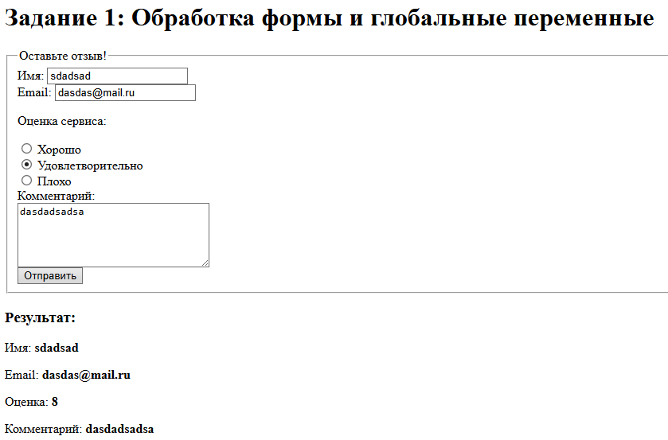

# lab5 Берёзов Артём
## 1. Инструкции по запуску проекта
1. Скачайте проект и разместите файлы в директории веб-сервера:
`git clone https://github.com/ваш-репозиторий.git`
2. Запустите сервер:
   `php -S localhost:8000`
4. Откройте в браузере:
   `http://localhost:8000`
   
## 2. Описание лабораторной работы   

__Цель:__ Познакомиться с глобальной переменной $_POST и обработкой данных из форм в PHP. Научиться валидировать пользовательские данные, работать с различными типами элементов формы, а также анализировать различия между $_REQUEST и $_POST.

## 3. Примеры использования проекта с приложением скриншотов или фрагментов кода

1. Работа с глобальной переменной $_POST
   Объясните, что такое глобальные переменные $_POST и $_SERVER["PHP_SELF"].
   
   $_POST — суперглобальный массив, содержащий данные, отправленные методом POST.

    $_SERVER["PHP_SELF"] — путь к текущему скрипту. Это позволяет форме отправляться на ту же страницу.

```php
<?php
    // Валидация формы задания 1
    $errors1 = [];
    $name1 = $_POST['name1'] ?? '';
    $email1 = $_POST['email1'] ?? '';
    $review1 = $_POST['review1'] ?? '';
    $comment1 = $_POST['comment1'] ?? '';

    if (isset($_POST["submit1"])) {
        if (empty($name1)) $errors1[] = "Имя обязательно";
        if (empty($email1) || !filter_var($email1, FILTER_VALIDATE_EMAIL)) $errors1[] = "Некорректный email";
        if (empty($comment1)) $errors1[] = "Комментарий обязателен";
    }
    ?>
    <form action="" method="POST">
        <fieldset>
            <legend>Оставьте отзыв!</legend>
            <label>Имя: <input type="text" name="name1" value="<?= htmlspecialchars($name1) ?>"></label><br>
            <label>Email: <input type="email" name="email1" value="<?= htmlspecialchars($email1) ?>"></label><br>
            <p>Оценка сервиса:</p>
            <label><input type="radio" name="review1" value="10" <?= $review1 == '10' ? 'checked' : '' ?>> Хорошо</label><br>
            <label><input type="radio" name="review1" value="8" <?= $review1 == '8' ? 'checked' : '' ?>> Удовлетворительно</label><br>
            <label><input type="radio" name="review1" value="5" <?= $review1 == '5' ? 'checked' : '' ?>> Плохо</label><br>
            <label>Комментарий:<br>
                <textarea name="comment1" cols="30" rows="5"><?= htmlspecialchars($comment1) ?></textarea>
            </label><br>
            <input type="submit" name="submit1" value="Отправить">
        </fieldset>
    </form>
    <?php if (isset($_POST["submit1"])): ?>
        <?php if (!empty($errors1)): ?>
            <ul style="color:red;">
                <?php foreach ($errors1 as $e) echo "<li>$e</li>"; ?>
            </ul>
        <?php else: ?>
            <h3>Результат:</h3>
            <p>Имя: <b><?= htmlspecialchars($name1) ?></b></p>
            <p>Email: <b><?= htmlspecialchars($email1) ?></b></p>
            <p>Оценка: <b><?= htmlspecialchars($review1) ?></b></p>
            <p>Комментарий: <b><?= htmlspecialchars($comment1) ?></b></p>
        <?php endif; ?>
    <?php endif; ?>

```

Скриншот: 



2. Получение данных с различных контроллеров

```php

<?php
    if (isset($_POST["submit2"])) {
        $name2 = $_POST['username2'] ?? '';
        $age2 = $_POST['age2'] ?? '';
        $city2 = $_POST['city2'] ?? '';
        $role2 = $_POST['role2'] ?? '';
        $sub2 = isset($_POST['subscribe2']) ? 'Да' : 'Нет';
        echo "<p>Имя: <b>$name2</b></p>";
        echo "<p>Возраст: <b>$age2</b></p>";
        echo "<p>Город: <b>$city2</b></p>";
        echo "<p>Тип участия: <b>$role2</b></p>";
        echo "<p>Подписка: <b>$sub2</b></p>";
    }
    ?>
    <form method="POST">
        <label>Имя: <input type="text" name="username2"></label><br>
        <label>Возраст: <input type="number" name="age2"></label><br>
        <label>Город:
            <select name="city2">
                <option value="Москва">Москва</option>
                <option value="Санкт-Петербург">Санкт-Петербург</option>
            </select>
        </label><br>
        <label><input type="checkbox" name="subscribe2" value="yes"> Подписаться на новости</label><br>
        <p>Тип участия:</p>
        <label><input type="radio" name="role2" value="Слушатель"> Слушатель</label>
        <label><input type="radio" name="role2" value="Докладчик"> Докладчик</label><br>
        <input type="submit" name="submit2" value="Отправить">
    </form>
``` 

Скриншот:

3. Создание, обработка и валидация форм
Объясните, чем отличаются глобальные переменные $_REQUEST и $_POST.

$_POST — содержит только данные, отправленные методом POST.

$_REQUEST — объединяет $_GET, $_POST и $_COOKIE. Менее безопасен, может содержать неожиданные данные.

```php

<?php

    $errors3 = [];
    $name3 = $_POST['name3'] ?? '';
    $mail3 = $_POST['mail3'] ?? '';
    $comment3 = $_POST['comment3'] ?? '';
    $agree3 = isset($_POST['agree3']);

    if (isset($_POST["submit3"])) {
        if (strlen($name3) < 3 || strlen($name3) > 20 || preg_match('/\d/', $name3)) {
            $errors3[] = "Имя должно быть от 3 до 20 символов и без цифр.";
        }
        if (!filter_var($mail3, FILTER_VALIDATE_EMAIL)) {
            $errors3[] = "Email указан неверно.";
        }
        if (empty($comment3)) {
            $errors3[] = "Комментарий обязателен.";
        }
        if (!$agree3) {
            $errors3[] = "Необходимо согласие на обработку данных.";
        }

        if (empty($errors3)) {
            echo "<p style='color:green;'>Форма успешно отправлена!</p>";
        } else {
            foreach ($errors3 as $err) {
                echo "<p style='color:red;'>$err</p>";
            }
        }
    }
    ?>
    <form method="POST">
        <label>Name: <input type="text" name="name3" value="<?= htmlspecialchars($name3) ?>"></label><br>
        <label>Email: <input type="email" name="mail3" value="<?= htmlspecialchars($mail3) ?>"></label><br>
        <label>Comment:<br><textarea name="comment3"><?= htmlspecialchars($comment3) ?></textarea></label><br>
        <label><input type="checkbox" name="agree3" <?= $agree3 ? 'checked' : '' ?>> Do you agree with data processing?</label><br>
        <input type="submit" name="submit3" value="Submit">
    </form>

```


Скриншот:   
            


4. Создание теста

```php

<h1>Задание 4: Форма теста</h1>
    <?php

    if (isset($_POST["submit4"])) {
    $username4 = $_POST["username4"] ?? '';
    if (is_array($username4)) $username4 = ''; // защита

    $q1 = $_POST["q1"] ?? '';
    $q2 = $_POST["q2"] ?? [];
    $q3 = trim($_POST["q3"] ?? '');

    $score = 0;

    if ($q1 === "интерпретируемым") $score++;
    if (in_array('$_POST', $q2) && in_array('$_SERVER', $q2) && count($q2) === 2) $score++;
    if ($q3 === "$") $score++;

    echo "<p>Имя: <b>$username4</b></p>";
    echo "<p>Результат: <b>$score / 3</b></p>";
    }
```
    ?>
    <form method="POST">
        <label>Имя: <input type="text" name="username4"></label><br>

        <p>1. Язык PHP является?</p>
        <label><input type="radio" name="q1" value="интерпретируемым"> Интерпретируемым</label>
        <label><input type="radio" name="q1" value="компилируемым"> Компилируемым</label><br>

        <p>2. Какие переменные являются суперглобальными?</p>
        <label><input type="checkbox" name="q2[]" value="$_POST"> $_POST</label>
        <label><input type="checkbox" name="q2[]" value="$GLOBALS"> $GLOBALS</label>
        <label><input type="checkbox" name="q2[]" value="$_SERVER"> $_SERVER</label><br>

        <p>3. Символ для объявления переменной в PHP?</p>
        <input type="text" name="q3"><br>

        <input type="submit" name="submit4" value="Завершить тест">
    </form>

```

    Скриншот:
    


## 5. Список использованных источников

https://metanit.com/php/tutorial/3.4.php

https://www.php.net/manual/ru/tutorial.forms.php
