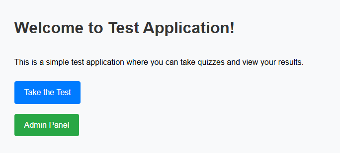
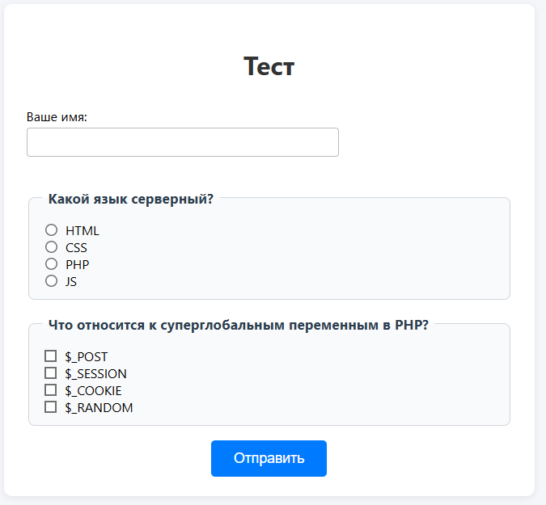
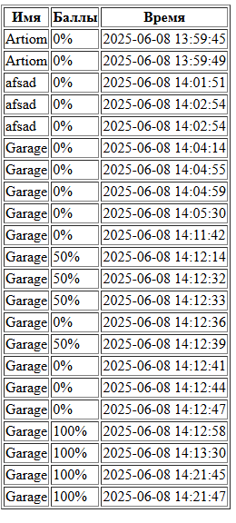
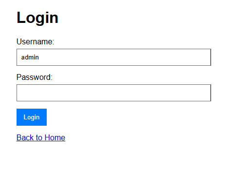

# Тестовое веб-приложение

## Описание
Это простое PHP-приложение для проведения онлайн-тестирования с административной панелью. Пользователь может пройти тест, увидеть результат, а администратор — просмотреть результаты всех пользователей.

## Функционал
- Прохождение теста с одиночным и множественным выбором
- Подсчет правильных ответов и процентов
- Сохранение результатов с именем пользователя и временем
- Админ-панель для просмотра всех результатов (требуется пароль)

## Инструкции по запуску
1. Клонируйте репозиторий или скопируйте файлы в папку `test_app`.
2. Перейдите в папку проекта:
   ```bash
   cd test_app
   ```
3. Запустите встроенный PHP-сервер:
   ```bash
   php -S localhost:8000
   ```
4. Откройте в браузере [http://localhost:8000](http://localhost:8000)

### Данные для входа администратора
- Логин: admin
- Пароль: admin123

## Пример тестов (questions.json)
```json
[
  {
    "question": "Столица Франции?",
    "type": "single",
    "answers": ["Париж", "Берлин", "Лондон", "Мадрид"],
    "correct": [0]
  },
  {
    "question": "Выберите цвета флага России:",
    "type": "multiple",
    "answers": ["Красный", "Синий", "Зеленый", "Белый"],
    "correct": [0,1,3]
  }
]
```

## Структура данных
- **data/questions.json** — массив вопросов:
  - `question` — текст вопроса
  - `type` — тип: `single` (один ответ) или `multiple` (несколько)
  - `answers` — массив вариантов
  - `correct` — массив индексов правильных ответов
- **data/results.json** — массив результатов:
  - `username` — имя пользователя
  - `correct` — количество правильных
  - `percent` — процент
  - `timestamp` — дата и время

## Скриншоты

- Главная страница:
  
- Страница теста:
  
- Результат теста:
  
- Админ-панель:
  
